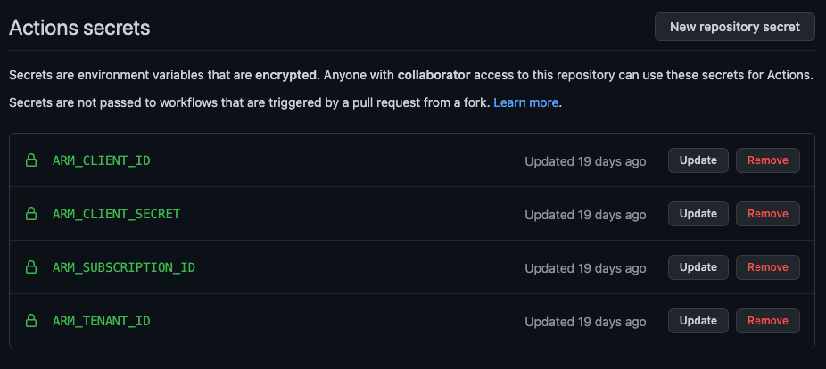
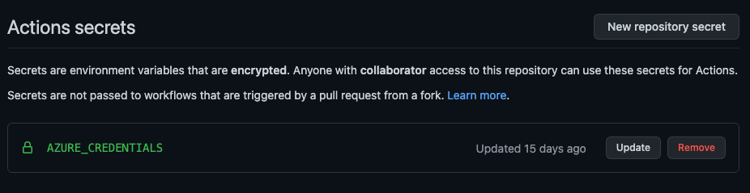

# Erstellen eines Azure Service Principals

Ein [Azure Service Principal](https://docs.microsoft.com/de-de/azure/active-directory/develop/app-objects-and-service-principals#service-principal-object) ist eine Identität, eine Art technischer Nutzer, innerhalb der Azure Umgebung um andere Ressourcen zu erstellen, zu modifieren, zu löschen oder auf diese zuzugreifen. Wie z.B. VMs, oder auch Azure Function Apps.

Diese [Identität](https://docs.microsoft.com/de-de/azure/active-directory/develop/app-objects-and-service-principals#service-principal-object) kann man in Umgebungen nutzen wo man sich nicht mit den persönlichen Login-Daten authentifizieren kann oder will. Dazu zählen beispielsweise Ausführungen von Scripten auf Buildservern oder in Buildservices, wie [GitHub Actions](https://github.com/features/actions) und [Azure Pipelines](https://azure.microsoft.com/de-de/services/devops/pipelines/).

In dem Repo wird gezeigt wie man einen Azure Service Principal über die Azure CLI erstellt und welche Werte man für die spätere Verwendung in Buildservices braucht und sichern sollte.


## Azure CLI

Das Erstellen eines Service Principals Users kann über die Azure CLI erfolgen. Eine Anleitung für die Installation von Azure CLI auf dem jeweiligen Betriebssystemen findet man hier:

* https://docs.microsoft.com/en-us/cli/azure/install-azure-cli


## Erstellen eines Service Principals über das Terminal mit Azure CLI

Für die Erstellung eines Service Principals über Azure CLI ist es nötig innerhalb der CLI angemeldet zu sein. Dies geschieht über den Befehl im Terminal:

```
az login
```

Jeder Service Principal hat einen festen Namen, über den dieser in Zukunft angesprochen werden kann. Da der Name für mehrere Befehle benötigt, wird dieser als Umgebungsvariable (`SERVICE_PRINCIPAL`) festgelegt. Der Name kann frei gewählt werden. Zum Festlegen der Umgebungsvariable die Anweisung, mit dem selbst gewählten Namen, im Terminal ausführen:

```
SERVICE_PRINCIPAL=sp-build-service
```

Um dem Service Principal einer Azure Subscription zuzuordnen, ist es nötig die **Subscription Id** bei der Erstellung mit anzugeben. Auch dieser Wert wird in einer Umgebungsvariable (`ARM_SUBSCRIPTION_ID`) für die spätere Verwendung gespeichert. Dies Abfrage der Id geschieht mit dem Befehl im Terminal:

```
ARM_SUBSCRIPTION_ID=$(az account list \
  --query "[?isDefault][id]" \
  --all \
  --output tsv)
```

Die Erzeugung des eigentlichen Service Principals erfolgt über folgenden Befehl. Die Rückgabe ist das **Secret** für den Service Principal. Auch dieses wird in einer Umgebungsvariable (`ARM_CLIENT_SECRET`) für die spätere, einmalige Ausgabe vorgehalten.

```
ARM_CLIENT_SECRET=$(az ad sp create-for-rbac \
  --name $SERVICE_PRINCIPAL \
  --role Owner \
  --scopes "/subscriptions/$ARM_SUBSCRIPTION_ID" \
  --query password \
  --output tsv)
```

Nach der Erzeugung des Service Principals wird die ID von diesem innerhalb der Azure Umgebung benötigt. Diese wird mit folgendem Befehl abgefragt und in eine Umgebungsvariable (`ARM_CLIENT_ID`) gespeichert:

```
ARM_CLIENT_ID=$(az ad sp list  \
  --filter "displayName eq '$SERVICE_PRINCIPAL'" \
  --query '@|[0]|appId' \
  --output tsv)
```

Zu guter Letzt wird noch die ID des **Tenant**, das oberste Zuordnungsobjekt zur Subscription in Azure, abgefragt und auch in einer Umgebungsvariable (`ARM_TENANT_ID`) abgelegt. Die Abfrage erfolgt mit folgendem Befehl im Terminal:

```
ARM_TENANT_ID=$(az ad sp show \
  --id $ARM_CLIENT_ID \
  --query appOwnerTenantId \
  --output tsv)
```

Damit sind nun alle nötigen Werte erzeugt und abgefragt, um über einen Build-Service auf die Ressourcen der Azure Cloud zuzugreifen.


### Speichern der Secrets

Die Ausgabe der gerade erzeugten Werte sollte nur einmalig erfolgen. Die Ausgabe sollte für die spätere Verwendung sicher vor Dritten gespeichert und danach aus der Historie des Terminals gelöscht werden. Niemals sollten die Werte irgendwo im Klartext auftauchen oder im Klartext verwendet werden, da mit diesen auf die Azure Infrastruktur zugegriffen werden kann.

Ausgeben lassen sich die Service Principal Werte mit:

```
echo ARMCLIENTID=$ARM_CLIENT_ID
echo ARMCLIENTSECRET=$ARM_CLIENT_SECRET
echo ARMTENANTID=$ARM_TENANT_ID
echo ARMSUBSCRIPTIONID=$ARM_SUBSCRIPTION_ID
```


## Verwendung des Service Principals in GitHub

GitHub bietet die Möglichkeit das schützenswerte Daten als **Secrets** im Repo abgelegt werden. Auf diese Secrets kann dann innerhalb eines GitHub Action Workflows zugegriffen werden.

Das Anlegen eines Secrets erfolgt über `Settings > Secrets > New repository secret` im jeweiligen Projekt-Repository. Das naträgliche Auslesen ist über die Weboberfläche nicht möglich. 

Innerhalb eines Worksflows kann man dann über folgenden Ausdruck auf ein Secret zugreifen:

```
${{ secrets.NAME_DES_SECRETS }}
```


### Verwendung von einzelnen Werten

In vielen Build-Pipelines wird auf die einzelnen Werte des Service Principals zugegriffen, also auf die **Client ID**, das **Client Secret**, die **Tenant ID** und die **Subscription ID**. 

Dafür muss in der jeweiligen Build-Umgebung dann jeweils eine Secret Variable erstellt werden. Über diese kann dann auf die einzelnen Werte im Build-Job zugegriffen werden. 

Hier ein Beispiel wie dies in den GitHub Actions Secrets aussehen kann:



Verwendung findet dieser Ansatz beispielsweise bei [terraform](https://www.terraform.io/), in der Authentifizierung zur Azure Cloud ([Authenticating using a Service Principal with a Client Secret](https://registry.terraform.io/providers/hashicorp/azurerm/latest/docs/guides/service_principal_client_secret)).


### JSON Representation

In gewissen Einsatzzwecken werden die Werte für den Service Principal als JSON Repräsentation benötigt. Das Format dafür sieht wie folgt aus:

```
{
   "clientId":"{ARM_CLIENT_ID}",
   "clientSecret":"{ARM_CLIENT_SECRET}",
   "subscriptionId":"{ARM_SUBSCRIPTION_ID}",
   "tenantId":"{ARM_TENANT_ID}"
}
```

Für die Verwendung müssen noch die Werte für `{ARM_CLIENT_ID}`, `{ARM_CLIENT_SECRET}`, `{ARM_SUBSCRIPTION_ID}` und `{ARM_TENANT_ID}` durch die jeweiligen konkreten Werte ersetzt werden.
Die JSON Struktur wird dann **einem** Secrets-Wert zugewiesen, wie z.B. hier `AZURE_CREDENTIALS` in den GitHub Actions Secrets:



Verwendet wird diese Format beispielsweise in den Actions für den Zugriff auf die Azure Cloud, siehe [azure/login@v1](https://github.com/marketplace/actions/azure-login).
